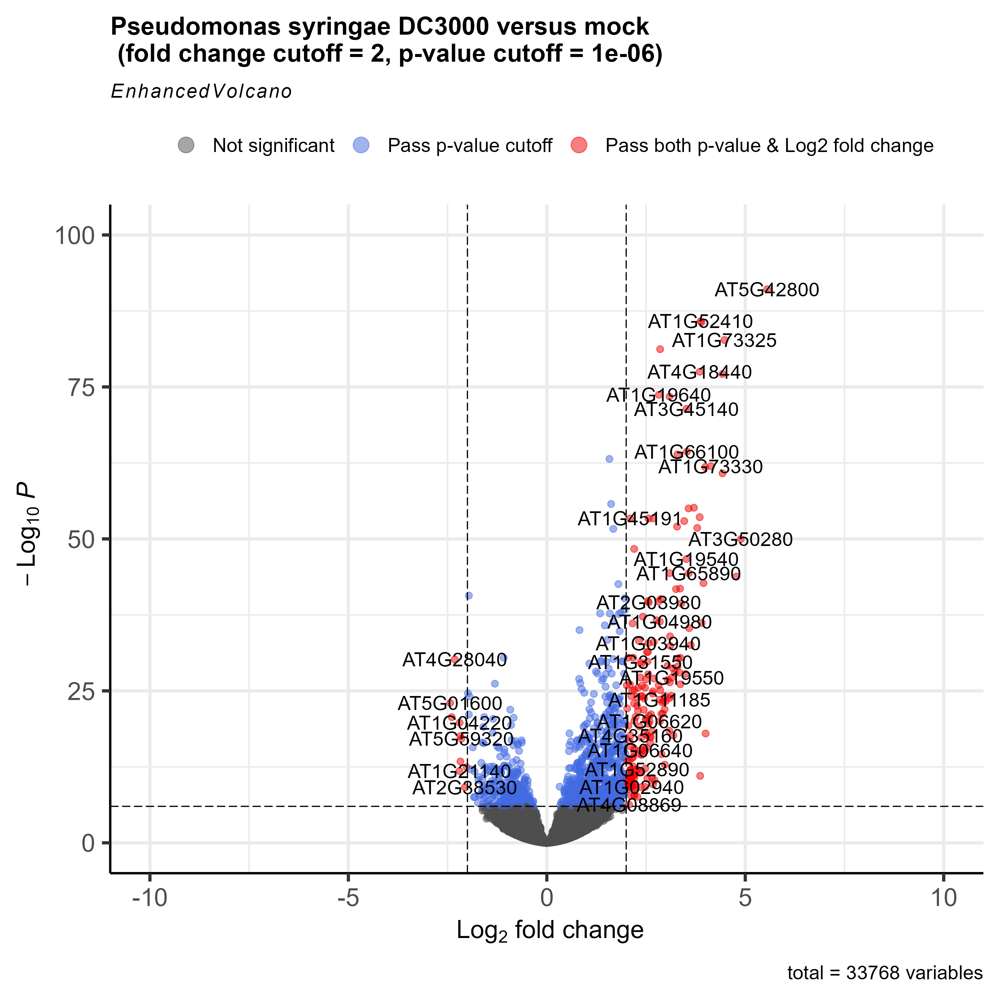
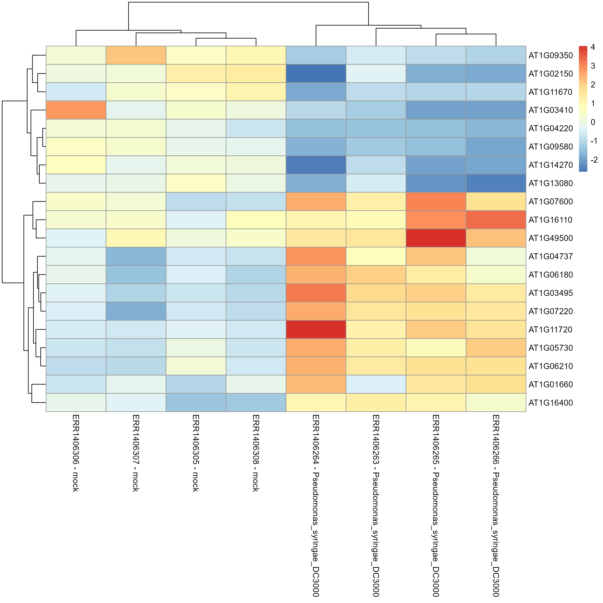

```{r setup, include=FALSE}
knitr::opts_chunk$set(echo = TRUE)
```

# Ładowanie danych i potrzebnych bibliotek
```{r, message=FALSE, warning=FALSE}
# Import libraries
library("rmdformats")
library("DESeq2")
library("tidyverse")

# import the samples to conditions correspodence
xp_design <- read.delim("dane_cz2/samples_to_conditions.txt",
                        header = T,
                        sep = ",",
                        stringsAsFactors = F,
                        colClasses = rep("character",4))%>%     # read columns as a character strings
  column_to_rownames("sample")
```

Ponieważ nie chcemy pracować nad wszystkimi porównaniami, odfiltrujemy próbki i warunki, których nie potrzebujemy. 

```{r}
xp_design_mock_vs_infected = xp_design %>% 
  filter(growth == "MgCl2" & dpi == "7")
```
Teraz przefiltrujemy zarówno obiekty, raw_countsjak i xp_design, aby zachować jednoczynnikowe porównanie i zbadać transkryptom liści roślin Arabidopsis, których nasiona zostały potraktowane MgCl2 i których rośliny zostały zakażone lub nie Pseudomonas syringae DC3000 w 7 dpi (po 7 dniach indukcji).

```{r}
# Import the gene raw counts
raw_counts <- read.csv("dane_cz2/raw_counts.csv", header = T, stringsAsFactors = F) %>% 
  column_to_rownames("Geneid")

# reorder counts columns according to the complete list of samples 
raw_counts <- raw_counts[ , row.names(xp_design)]

# Filter count file accordingly (to keep only samples present in the filtered xp_design file)
raw_counts_filtered = raw_counts[, colnames(raw_counts) %in% row.names(xp_design_mock_vs_infected)]

all(colnames(raw_counts_filtered) %in% rownames(xp_design_mock_vs_infected))
all(colnames(raw_counts_filtered) == rownames(xp_design_mock_vs_infected))
```
Teraz gdy kolumny i wiersze są dopasowane możemy utworzyć objekt DESeqDataSet

```{r}
## Creation of the DESeqDataSet
dds <- DESeqDataSetFromMatrix(countData = raw_counts_filtered, 
                              colData = xp_design_mock_vs_infected, 
                              design = ~ infected)

dds
```
Domyślnie R wybierze poziom odniesienia dla czynników na podstawie porządku alfabetycznego. Wtedy, jeśli nigdy nie powiesz funkcjom DESeq2, z którym poziomem chcesz porównać (np. który poziom reprezentuje grupę kontrolną), porównania będą oparte na kolejności alfabetycznej poziomów. Można to rozwiązać w ten sposób, aczkolwiek u nas jest poprawnie.
```{r}
dds$infected
#dds$infected <- factor(dds$infected, levels = c("mock","Pseudomonas_syringae_DC3000"))
```


# Przeprowadzenie analizy DE
Przy użyciu funkcji Results, wyodrębiniana jest tabela wyników z log2-krotnymi zmianami, wartościami p i skorygowanymi wartościami p. 
```{r, message=FALSE, warning=FALSE}
dds <- DESeq(dds)
all_genes_results <- results(dds)
head(all_genes_results) 
```
**Interpretacja logarytmu krotności zmiany (log2FoldChange)**\
Dodatnia wartość log2FoldChange wskazuje, że poziom ekspresji genu jest wyższy w grupie leczonej w porównaniu z grupą kontrolną, podczas gdy wartość ujemna wskazuje, że poziom ekspresji jest niższy w grupie leczonej. Wielkość wartości log2FoldChange wskazuje stopień różnicy w poziomach ekspresji genów między dwiema grupami.\
Przykład:\
untreated = 230\
treated = 750\
log2(treated/untreated) # equals 1.705257

U nas:\
log2(Pseudomonas syringae DC3000 / mock)

Dla przykładu, gdy log2FoldChange wynosi 1, oznacza to, że ekspresja danego genu w jednej grupie jest dwukrotnie większa niż w drugiej grupie. Z kolei, gdy log2FoldChange wynosi -1, oznacza to, że ekspresja danego genu w jednej grupie jest dwukrotnie mniejsza niż w drugiej grupie.

```{r}
mcols(all_genes_results)
```

# P-value i P-value adjusted

**P-value** to wartość określająca prawdopodobieństwo wystąpienia różnic lub zależności między dwiema zmiennymi w próbie badawczej, przy założeniu, że hipoteza zerowa jest prawdziwa. Niskie wartości p-value sugerują, że wyniki badania są znaczące statystycznie, co oznacza, że hipoteza zerowa może zostać odrzucona na rzecz alternatywnej hipotezy badawczej.

P-value nie uwzględnia jednak faktu, że wiele porównań statystycznych może zostać przeprowadzonych w ramach jednego badania, co zwiększa ryzyko popełnienia błędu typu I (fałszywie odrzucenie hipotezy zerowej, gdy jest ona prawdziwa). Aby zminimalizować to ryzyko, można skorygować p-value za pomocą p-value adjust, zwanej również korektą multipleksową.

**P-value adjusted** to wartość p, która uwzględnia liczbę porównań statystycznych przeprowadzonych w badaniu. W wyniku tej korekty, wartość p jest zwykle wyższa niż wartość oryginalnego p-value. Zastosowanie p-value adjusted pozwala na bardziej rygorystyczne określenie, które wyniki badania są statystycznie istotne.

# Fałszywe wskaźniki odkrycia

```{r}
library(dplyr)

# threshold of p = 0.01
all_genes_results %>% 
  as.data.frame() %>% 
  filter(padj < 0.01) %>% 
  dim()

# threshold of p = 0.001
all_genes_results %>% 
  as.data.frame() %>% 
  filter(padj < 0.001) %>% 
  dim()

# distribution of adjusted p-values
hist(all_genes_results$padj, col="lightblue", main = "Adjusted p-value distribution")

# distribution of non-adjusted p-values
hist(all_genes_results$pvalue, col="grey", main = "Non-adjusted p-value distribution")
```


Rozkład wartości p był już dość podobny, co sugeruje, że znaczna część testów ma znaczącą wartość p. 

# Wyodrębnianie tabeli różnicujących genów

```{r}
diff_genes = all_genes_results %>% 
  as.data.frame() %>% 
  rownames_to_column("genes") %>% 
  filter(padj < 0.01) %>% 
  arrange(desc(log2FoldChange), 
          desc(padj))
head(diff_genes)
#write.csv(diff_genes, file = "geny_roznicujace.txt" )
```

# Wulkanoplot

Kurczymy log2FoldChange aby usunąć szum wynikający z genów z małą ilością zliczeń.
Pomaga to uzyskać bardziej znaczące log2FoldChange (LFC) dla wszystkich genów niezależnie od ich poziomu ekspresji.
```{r, message=FALSE, warning=FALSE}
library("apeglm")

resLFC <- lfcShrink(dds = dds, 
                  res = all_genes_results,
                  type = "normal",
                  coef = "infected_Pseudomonas_syringae_DC3000_vs_mock")
```

head(order(resLFC$padj),20) zwraca indeksy 20 genów o najmniejszych wartościach skorygowanych wartości p. Te geny są uważane za najbardziej różnicujące między grupami.


Parametr "dds" to obiekt klasy "DESeqDataSet", który zawiera informacje o danych sekwencjonowania RNA, takie jak liczba odczytów dla każdego genu w każdej próbce. Parametr "res" zawiera wyniki różnicowej ekspresji dla wszystkich genów, które zostały uzyskane z użyciem funkcji "results" z pakietu "DESeq2".

Parametr "type" określa metodę zwijania, która ma być użyta. W tym przypadku jest to metoda "normal". Oznacza to, że zostanie zastosowana metoda zwijania Bayesa z wagami równymi dla każdego genu.

Parametr "coef" określa, który współczynnik regresji ma zostać użyty do porównania między próbkami zainfekowanymi a kontrolnymi. W tym przypadku jest to "infected_Pseudomonas_syringae_DC3000_vs_mock".

Funkcja "lfcShrink" zwraca wyniki zwiniętej różnicowej ekspresji log2FC dla każdego genu.


Współczynniki (coef) są istotne w analizie DE, ponieważ pozwalają określić, jakie porównanie między grupami lub poziomami zmiennej objaśniającej jest badane pod kątem różnicowej ekspresji.
Aby zobaczyć, jakie współczynniki można wyodrębnić:
```{r}
resultsNames(dds)
```

```{r}
# load the library if not done yet
library("EnhancedVolcano")


# The main function is named after the package
ev_plot <- EnhancedVolcano(toptable = resLFC,
                x = "log2FoldChange",
                y = "padj",
                lab = rownames(resLFC),
                xlim = c(-10, +10),
                ylim = c(0,100),
                pCutoff = 1e-06,
                FCcutoff = 2, 
                title = "Pseudomonas syringae DC3000 versus mock \n (fold change cutoff = 2, p-value cutoff = 1e-06)",
                legendLabels=c('Not significant',
                  'Log2 fold-change (but do not pass p-value cutoff)',
                  'Pass p-value cutoff',
                  'Pass both p-value & Log2 fold change')
                )
#ggsave("wulkano_plot.png", plot = ev_plot, width = 10, height = 10)

```

{#id .class width=90% height=90%}\


Wykres wulkanu to rodzaj wykresu rozrzutu, który pokazuje istotność statystyczną (wartość P) w funkcji wielkości zmiany (krotność zmiany). Umożliwia szybką identyfikację wizualną genów z dużymi fałdami zmian, które są również istotne statystycznie. Mogą to być geny o największym znaczeniu biologicznym. Na wykresie wulkanu geny o największej regulacji w górę znajdują się po prawej stronie, geny o największej regulacji w dół po lewej, a najbardziej statystycznie istotne geny są u góry.

# Normalizacja

Najpierw znormalizujemy raw_counts za pomocą niestandardowej funkcji, która naśladuje procedurę normalizacji DESeq2 
```{r}
# import custom function
# copy-paste and execute this code in your console to get the mor_normalization() function

mor_normalization = function(data){
  library(dplyr)
  library(tibble)

  # take the log
  log_data = log(data) 
  
  # find the psuedo-references per sample by taking the geometric mean
  log_data = log_data %>% 
               rownames_to_column('gene') %>% 
               mutate (gene_averages = rowMeans(log_data)) %>% 
               filter(gene_averages != "-Inf")
  
  # the last columns is the pseudo-reference column 
  pseudo_column = ncol(log_data)
  
  # where to stop before the pseudo column 
  before_pseduo = pseudo_column - 1
  
  # find the ratio of the log data to the pseudo-reference
  ratios = sweep(log_data[,2:before_pseduo], 1, log_data[,pseudo_column], "-")
  
  # find the median of the ratios
  sample_medians = apply(ratios, 2, median)
  
  # convert the median to a scaling factor
  scaling_factors = exp(sample_medians)
  
  # use scaling factors to scale the original data
  manually_normalized = sweep(data, 2, scaling_factors, "/")
  return(manually_normalized)
}
```


```{r}
scaled_counts <- mor_normalization(raw_counts_filtered)
head(scaled_counts)
```

Ta procedura skalowania nie zmienia zasadniczo naszych wartości liczby genów. 

```{r}
long_scaled_counts = 
  scaled_counts %>% 
  rownames_to_column("gene") %>% 
  pivot_longer(-gene, names_to = "sample", values_to = "counts") %>% 
  mutate(scaled = "yes")

long_raw_counts = 
  raw_counts %>% 
  rownames_to_column("gene") %>% 
  pivot_longer(-gene, names_to = "sample", values_to = "counts") %>% 
  mutate(scaled = "no")

long_raw_and_scaled_counts = bind_rows(long_raw_counts, long_scaled_counts)

ggplot(long_raw_and_scaled_counts, 
       aes(x = scaled, y = counts + 1, fill = scaled)) +
  geom_violin() +
  scale_y_log10() +
  labs(x = "Gene counts scaled/normalised?", y = "Gene counts (raw or scaled)")
```

# Heatmap (mapa cieplna)

```{r}
counts_normalised_only_diff_genes = 
  mor_normalization(raw_counts) %>%             # normalize the counts using our custom function
  rownames_to_column("genes") %>%               
  pivot_longer(- genes,                         
               names_to = "sample", 
               values_to = "counts") %>% 
  filter(genes %in% diff_genes$genes) %>%             
  pivot_wider(names_from = "sample",            
              values_from = "counts")  %>%      
  column_to_rownames("genes")                   # the gene column is converted back to row names to create a matrix usable with pheatmap

dim(counts_normalised_only_diff_genes)          # check that you have the expected number of rows and columns
```
Rzeczywiście stwierdzamy, że mamy 4979 różnicujących genów (wiersze, p <0, 01) i 48 próbek (kolumny).

```{r}
set.seed(1)
x <- runif(7)

# Manually scaling
(x - mean(x)) / sd(x)

# With scale function
scale(x)[,1]
```


```{r}
counts_scaled = 
  counts_normalised_only_diff_genes %>% 
  t(.) %>%                              # transpose to have the genes in columns 
  scale() %>%                           # scale(x, center = TRUE, scale = TRUE) 
  t(.)                                  # back in original shape

# sanity check
# the majority of the values should be around zero
apply(counts_scaled, MARGIN = 1, mean) %>%                          # calculate the mean per row
  hist(., main = "", xlab = "Z-score values", col = "dodgerblue2")  
```


Z-score dla każdego genu Z= (x - μ) /σ  Gdzie X to indywidualna liczba genów w danej próbce, μ średnią wiersza dla tego genu we wszystkich próbkach, a σ to jego odchylenie standardowe.

Z-score to wartość statystyczna wyrażająca liczbę odchyleń standardowych wartości od średniej populacji. Wynikowy Z-score dla danego genu i próbki mówi, ile standardowych odchyleń wynikających z ekspresji genu w próbce jest oddalone od średniej ekspresji tego genu we wszystkich próbkach. Ujemne wartości Z-score oznaczają, że ekspresja danego genu jest niższa niż średnia, podczas gdy wartości dodatnie oznaczają, że ekspresja jest wyższa niż średnia.


```{r}
counts_scaled_filtered = 
  counts_scaled %>% 
  as.data.frame() %>%
  dplyr::select(row.names(xp_design_mock_vs_infected)) # keep the 8 samples

head(counts_scaled_filtered)
```

```{r}
topGenes <- head(order(diff_genes$padj),20)
```

```{r}
top_counts_scaled_filtered <- counts_scaled_filtered[topGenes,]
```

```{r}
# pheatmap_top_genes <-as.matrix(top_counts_scaled_filtered)
# colnames(pheatmap_top_genes) <- paste(row.names(xp_design_mock_vs_infected), xp_design_mock_vs_infected$infected, sep = " - " )
# 
# heatmap <- pheatmap(pheatmap_top_genes)
# #ggsave("heatmap.png", plot = heatmap, width = 10, height = 10)
```

{#id .class width=90% height=90%}\


