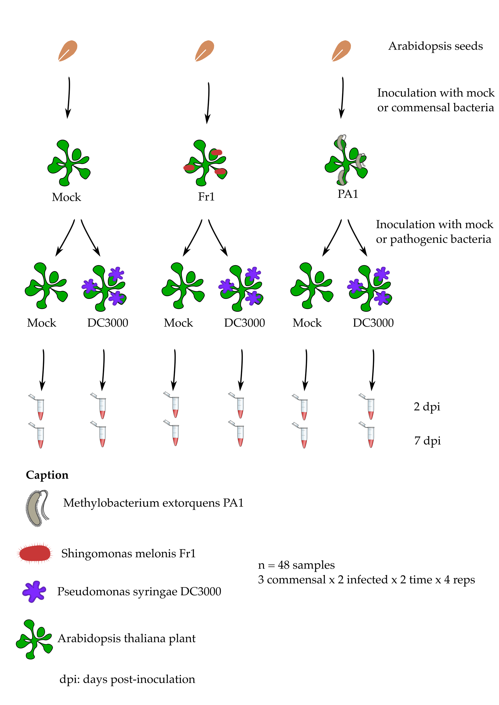
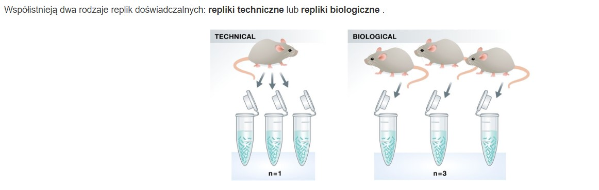
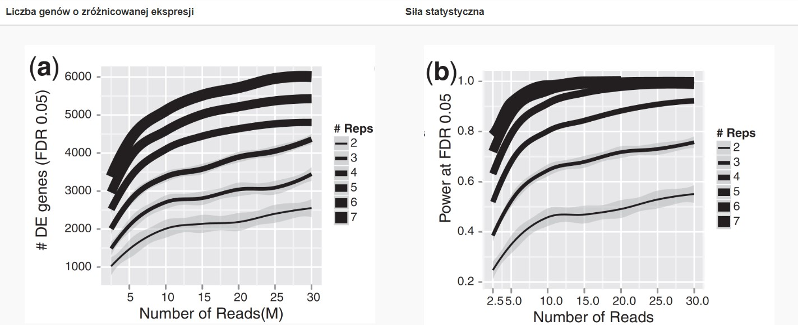
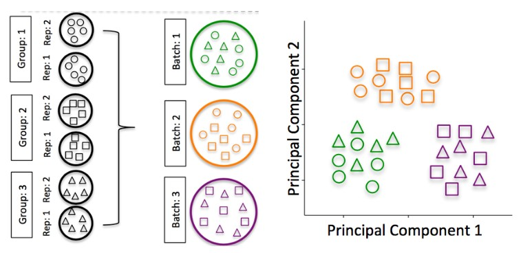
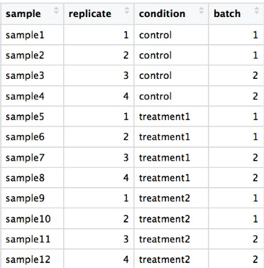
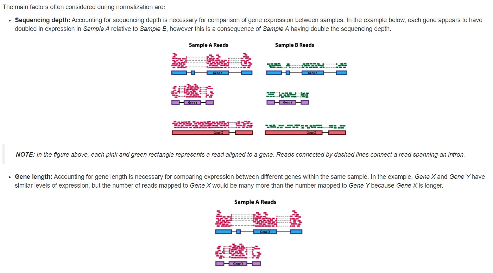
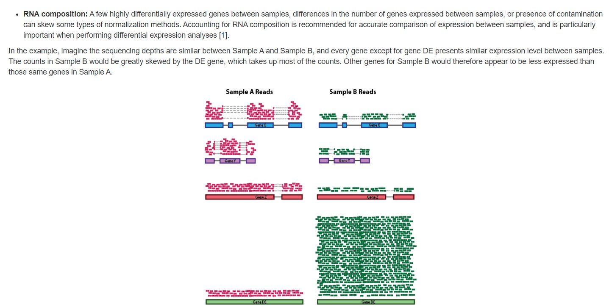
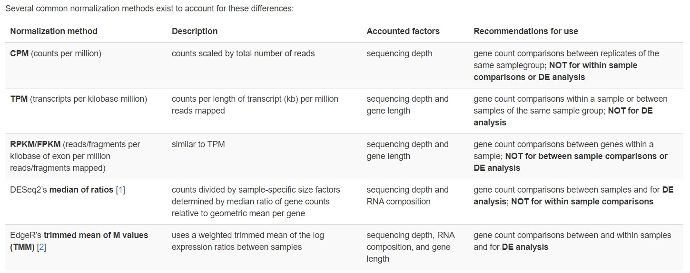

```{r setup, include=FALSE}
knitr::opts_chunk$set(echo = TRUE)
```

# Wstęp
Wykorzystamy opublikowany zestaw danych eksperymentalnych z badań przeprowadzonych na małej modelowej roślinie Arabidopsis thaliana.\
To badanie porównuje reakcję 4-tygodniowych sadzonek na różne bakterie żyjące na liściach różnych gatunków roślin:

Znany patogen liściowy o nazwie Pseudomonas syringae szczep DC3000.
Komensalna („neutralna”) bakteria zwana Methylobacterium extorquens szczep PA1.
Komensalna („neutralna”) bakteria zwana Sphingomonas melonis szczep Fr1.

Próbki liści pobrano z sadzonek Arabidopsis z roślin inokulowanych lub nie inokulowanych bakteriami komensalnymi i zakażonych lub nie patogenem liści albo po dwóch dniach (2 dpi, dpi: dni po inokulacji) albo siedmiu dniach (7 dpi).

{#id .class width=50% height=50%}\

# Średnia czy mediana (wartość środkowa zbioru / 2 kwartyl)?

**Kwartyle** (inaczej – wartości ćwiartkowe) to wartości, które dzielą zebrane obserwacje na cztery równe, co do ilości elementów, grupy.

Możemy wyobrazić je sobie jako trzy linie, które dzielą ciąg liczbowy na cztery zbiory o równiej liczbie elementów, dlatego też wyróżniamy:

* **pierwszy kwartyl (Q1)** – 25% obserwacji położonych jest poniżej, a 75% powyżej
* **drugi kwartyl (Q2)** (inaczej mediana dzieli zbiór obserwacji na dwie równe części
* **trzeci kwartyl (Q3)** – 75% obserwacji położona jest poniżej, a 25% powyżej


Decydując, która miara będzie bardziej właściwa do omówienia wyników analizy statystycznej należy się kierować przede wszystkim informacjami o rozkładzie danych. W przypadku danych o rozkładzie normalnym można analizować średnią wraz z odchyleniem standardowym. W przypadku danych, których rozkład odbiega od rozkładu normalnego interpretowanie średniej nie jest właściwym rozwiązaniem. Brak rozkładu normalnego oznacza bowiem, że wśród danych pojawiają się przypadki "odstające", które wpływają na wartość średniej. W takiej sytuacji interpretacji należy dokonywać w oparciu o medianę oraz kwartyle,ponieważ mediana jest niezależna od wartości skranych (często używana w testach nieparametrycznych).

**Testy nieparametryczne** należą do rodziny tak zwanych odpornych metod statystycznych. Oznacza to, że duże odchylenia od przeciętnych wartości (obserwacje odstające) nie wpływają negatywnie na nasze wyniki tak jak ma to miejsce w przypadku metod parametrycznych

# Miary rozpiętości

**Wariancja = Σ (xi - μ)² / n**\
*Gdzie Σ to suma, xi to każdy punkt danych, μ to średnia danych, a n to liczba punktów danych.*\
**Odchylenie standardowe = √Wariancja**

**Wariancja** – miara rozproszenia wyników wokół średniej, możliwa do obliczenia tylko dla zmiennych o ilościowym poziomie pomiaru.
Wariancja jest wyliczana poprzez iloraz zsumowanych kwadratów odchyleń wyników od średniej przez liczbę wyników pomniejszoną o 1. Wartość wariancji jest podstawą do uzyskania wartości odchylenia standardowego, które to jest obliczanie poprzez wyciągnięcie pierwiastka kwadratowego z wariancji. W ten sposób eliminujemy wartości ujemne z terminu zmienność, jako że nieistnieje minusowa zmienność. Im większa wariancja, tym bardziej nasze dane są rozproszone, a im mniejsza wariancja, tym bardziej nasze dane są skoncentrowane wokół średniej.

**Odchylenie standardowe** (ang. SD – Standard Deviation) jest podstawową miarą zmienności rozkładu, która określa w jakim stopniu wartości ze zbioru danych rozproszone są wokół wartości średniej. Odchylenie standardowe jest pierwiastkiem kwadratowym z wariancji. Im mniejsza wartość odchylenia tym obserwacje są bardziej skupione wokół średniej.


# Test hipotezy

Załóżmy, że badamy roślinny gen o nazwie „czynnik transkrypcji stresu cieplnego A-2” (HSFA2) , którego ekspresja może zostać zwiększona przez stres cieplny. Dlatego mierzysz ten poziom transkryptu genu w dwóch warunkach: normalnym i stresu cieplnego.

H0 (hipoteza zerowa)
„Średnia ekspresja genu HSFA2 jest taka sama w normalnych warunkach, jak w przypadku stresu cieplnego u sadzonek Arabidopsis”.

H1 (hipoteza alternatywna)
„Średnia ekspresja genu HSFA2 jest inna w warunkach stresu cieplnego w porównaniu z normalnymi warunkami u sadzonek Arabidopsis”.

```{r, message=FALSE, warning=FALSE}
library(tidyverse)
set.seed(1234) # to have the same graph everytime you run this code

xp_normal_conditions <- tibble(
  expression = rnorm(             # randomly sample numbers from a normal distribution
    n = 1000,                     # number of drawings
    mean = 2,                     # mean of the normal distribution
    sd = 0.1),                    # standard deviation of the normal distribution
  condition = "normal"            # used later on for data frame row binding with heat stress
  )

head(xp_normal_conditions)
```
Wykeślając rozkład ekspresji genu HSF2A otrzymujemy spodziewaną krzywą gaussowską.\
Pole pod krzywą sumuje się do 1 (co odpowiada 100% danych). 

```{r}
p2 <- ggplot(xp_normal_conditions, aes(x = expression, fill = condition)) +
  ggtitle("Distribution of HSF2A expression levels in 1000 samples") +
  theme(legend.position = "none") +
  geom_density(color = "black", alpha = 0.5) 
p2
```

```{r}
xp_heat_stress <- tibble(expression = rnorm(n = 1000, mean = 4, sd = 0.5),
                         condition = "heat stress")

xp = bind_rows(xp_normal_conditions, xp_heat_stress) # get a peek with head(xp) and tail(xp)

p3 <- ggplot(xp, aes(x = expression, fill = condition)) +
  ggtitle("Distribution of HSF2A expression levels in 1000 samples") +
  geom_density(color = "black", alpha = 0.5) 
p3
```
<p></p>
## Test t Studenta 
jest metodą statystyczną służącą do porównania dwóch średnich między sobą.\
Dzięki niemu możemy dowiedzieć się czy dwie różne średnie są różne w wyniku przypadku, czy są istotnie statystycznie.

**Wyróżniamy różne rodzaje testu:**\
{#id .class width=50% height=50%}\

* **Test t Studenta dla jednej próby**
    - Badacz może chcieć sprawdzić, czy średnia ocena IQ dla grupy studentów różni się od 100.
    - Czy mój wzrost jest statystycznie wyższy/niższy od kobiet w moim wieku w populacji.
    - Czy średni pomiar temperatury w lipcu w Polsce wynosi 21,3̊C?

* **Test t Studenta dla prób niezależnych**\
    - Na uniwersytecie postanowiono sprawdzić, czy studenci, którzy uczestniczyli w zajęciach ze statystyki        prowadzonych on-line mają lepszy wynik z egzaminu końcowego niż studenci, którzy uczestniczyli w             standardowych zajęciach na uczelni. \
    Ten rodzaj testu ma zastosowanie od porównania wyników dla dwóch niezależnych grup, np. grupy kontrolnej     z grupą eksperymentalną, grupę kobiet i grupę mężczyzn lub grupę studentów studiów humanistycznych ze        studentami studiów ścisłych.

* **Test t Studenta dla prób zależnych**
    - Badacz testuje działanie nowego leku na obniżenie ciśnienia krwi. W grupie 50 pacjentów, dla każdego z       nich, dokonywany jest pomiar ciśnienia krwi przed i po podaniem leku. 
W celu sprawdzenia, czy różnice są istotne statystycznie należy wykonać test t dla prób zależnych. Próby są zależne dlatego, że wynik pierwszego pomiaru oraz wynik drugiego pomiaru dotyczą tych samych obserwacji. 


**Estymator** to funkcja matematyczna, która na podstawie dostępnych danych próbkowych pozwala szacować wartość nieznanego parametru populacji.
Przykładem estymatora jest średnia arytmetyczna próby, która jest estymatorem wartości średniej populacji.\
*Estymator jest nieobciążony*, gdy średnia wartość estymatora z dalszych prób jest zbliżona do wartości estymowanego parametru populacji.

**alternative = "two.sided"** oznacza, że hipoteza alternatywną jest to, że średnie wartości obu grup różnią się, ale nie jest określone, która z tych wartości jest większa.

**Przedział ufności (confidence interval)** to zakres wartości, w której z określonym prawdopodobieństwem znajduje się prawdziwa wartość parametru populacji.\
Przedział ufności o poziomie ufności 95% oznacza, że w 95% przypadków podobnej próby estymator wartości populacji będzie mieścił się w przedziale ufności.


### Przeprowadzamy zatem test t studenta dla prób niezaleznych
```{r}
t.test(x = xp_normal_conditions$expression, 
       y = xp_heat_stress$expression, 
       alternative = "two.sided" ,      
       var.equal = FALSE,             # important as the variance do not seem equal
       paired = FALSE,                # Student's t-test for two independent samples
       conf.level = 0.95)             # corresponds to alpha = 0.05 
```
**df** to stopnie swobody, czyli liczba obserwacji w obu grupach, które mają wpływ na wynik testu. 

**Wartość p-value** jest bardzo mała i wynosi < 2.2e-16, co oznacza, że różnica między grupami jest istotna statystycznie.

**95 percent confidence interval** to przedział ufności 95%, czyli przedział, w którym z pewnym prawdopodobieństwem (95%) mieści się różnica między średnimi wartościami w populacji. W tym przypadku przedział ufności wynosi od -2.040977 do -1.978850.

**Wniosek**: Średnia ekspresja genu HSFA2 w drugiej grupie (wykazującej stres cieplny) jest wyraźnie wyższa niż w pierwszej grupie (bez stresu cieplnego).


# Błędy I i II rodzaju 


Błędy typu I pojawiają się, gdy hipoteza H0 (zerowa) zostaje błędnie odrzucona, pomimo że jest prawdziwa.\
Błędy typu II pojawiają się, gdy hipoteza H0 (zerowa) zostaje błędnie przyjęta pomimo że jest nieprawdziwa.

H0 - Brak oznak ciąży\

{#id .class width=80% height=80%}\

### Obliczanie mocy testu dla testu t dla dwóch prób niezależnych

Moc testu (moc statystyczna) to prawdopodobieństwo uniknięcia błędu drugiego rodzaju – przyjęcia hipotezy zerowej, gdy w rzeczywistości jest ona fałszywa. Im większe jest to prawdopodobieństwo, tym lepszy jest dany test jako narzędzie do różnicowania między hipotezą prawdziwą i fałszywą. Moc można wyrazić jako dopełnienie prawdopodobieństwa popełnienia błędu drugiego rodzaju (β), czyli 1-β.

```{r}
library("pwr")

pwr.t.test(d = 1,
           power = .8,
           sig.level = .05,
           type = "two.sample",
           alternative = "two.sided")
```
Ile próbek potrzebuję?
Potrzebowalibyśmy 16 próbek w każdej grupie.


Moc testu wynosząca 0,8 oznacza, że istnieje 80% szans na wykrycie rzeczywistej różnicy między dwoma grupami przy użyciu testu t, jeśli ta różnica wynosi 1.

**!Niska moc może prowadzić do braku powtarzalności wyników badań. **


# Repliki biologiczne i techniczne

{#id .class width=80% height=80%}\
**Repliki biologiczne** w sekwencjonowaniu RNA (RNA-seq) to powtórzone próby analizy ekspresji genów, w których pobierane są próbki tkankowe lub komórkowe z tego samego typu tkanki lub komórki, a następnie izolowane są z nich cząsteczki RNA.

Celem powtarzania próbek jest zmniejszenie wpływu losowych czynników na wynik analizy, takich jak błędy techniczne lub biologiczne zmienności między próbkami. 

**Repliki techniczne** polegają na używaniu tej samej próbki biologicznej do powtórzenia etapów technicznych lub eksperymentalnych w celu dokładnego zmierzenia zmienności technicznej.

W czasach mikromacierzy techniczne repliki uważano za konieczność; jednak przy obecnych technologiach RNA-Seq zmienność techniczna jest znacznie mniejsza niż zmienność biologiczna, a repliki techniczne są niepotrzebne .

W przeciwieństwie do tego replikaty biologiczne są niezbędne. W przypadku analizy ekspresji różnicowej im więcej powtórzeń biologicznych, tym lepsze oszacowania zmienności biologicznej i dokładniejsze nasze oszacowania średnich poziomów ekspresji.


**Głębokość sekwencjonowania (ang. sequencing depth)** to miara liczby odczytów sekwencji DNA lub RNA uzyskanych podczas eksperymentu sekwencjonowania.
Jednakże, wysoka głębokość sekwencjonowania może prowadzić do kosztów finansowych i zwiększonego czasu obliczeniowego potrzebnego do przetworzenia danych sekwencjonowania. Dlatego dobór odpowiedniej głębokości sekwencjonowania zależy od celu eksperymentu, rodzaju próbki, dostępnych zasobów i kosztów.


{#id .class width=85% height=85%}\

Rysunek przedstawia zależność między głębokością sekwencjonowania a liczbą powtórzeń w stosunku do liczby zidentyfikowanych genów o zróżnicowanej ekspresji.\
Możemy zobaczeć że powtórzenia biologiczne mają większe znaczenie niż głębokość sekwencjonowania.
Aczkolwiek do wykrycia genów DE ("differentially expressed genes") o niskiej ekspresji i do przeprowadzenia różnicowej ekspresji na poziomie izoform wymagana jest większa głębokość.


# Batch effects

{#id .class width=85% height=85%}\

Batch efekt to rodzaj zmienności lub zakłócenia w wynikach eksperymentu, które nie wynikają bezpośrednio z różnic między badanymi grupami, ale z różnic w procesach technicznych między różnymi partiami eksperymentu.

Batch efekty mogą wynikać z wielu czynników technicznych, takich jak różnice w wydajności ekstrakcji, zmienności w czasie reakcji enzymatycznych, różnice w jakości użytych reagentów lub sprzętu, a także różnice w wykonaniu i przetwarzaniu próbek. Batch efekty są szczególnie problematyczne w przypadku badań ekspresji genów, ponieważ wpływają one na wiele genów jednocześnie i mogą prowadzić do błędnych wniosków i wyników.

Jeśli w naszym eksperymencie wystąpi taki efekt to należy go uwzglednić w metadanych.

{#id .class width=50% height=50%}\ 


# Instalacja potrzebnych bibliotek

```{r, message=FALSE, warning=FALSE}
library("DESeq2")
library("tidyverse")
library("EnhancedVolcano")
library("pheatmap")
library("clusterProfiler")
library("org.At.tair.db")
library("biomaRt")
library("biomartr")
library("pwr")
library("dplyr")
library("ggplot2")
library("hexbin")
library("RColorBrewer")

```

W analizie (bio)chemicznej macierze danych mogą być bardzo duże. Na przykład widmo w podczerwieni (800 długości fal) dla 50 próbek dałoby macierz danych o rozmiarze 40 000 (50x800) liczb.

Te macierze są tak duże, że potrzebujemy wygodnych sposobów wydobywania ważnych informacji z tych dużych macierzy danych.

Zatem dane można zredukowac do mniejszych macierzy przy użyciu analizy głównych składników (PCA)

# Ocena jakości eksperymentów RNA-seq

## Przykład na zestawie danych tęczówki PCA
{#id .class width=90% height=90%}\ 


W tym układzie współrzędnych PC1 wyjaśnia 99,77% całkowitej zmienności oryginalnego zestawu danych, podczas gdy PC2 wyjaśnia tylko 0,23%. W konsekwencji tylko zmienna (PC1) jest wystarczająca do opisania całego zbioru danych, co potwierdzałoby wniosek, że istnieje tylko 1 podstawowy czynnik, w tym przypadku wiek.

```{r}
library(datasets)
data(iris)
head(iris)
```

```{r}
# define a custom R function called "mypca()"
mypca <- function(x, center = TRUE, scale = TRUE){
  # Samples should be in rows
  # Variables in the columns

  # remove constant variables
  constant_val = apply(x,2,'sd')
  x_reduced = x[,constant_val>0]
  
  # perform SVD
  SVD <- svd(scale(x_reduced,center = center, scale = scale))
  
  # create scores data frame
  scores <- as.data.frame(SVD$u %*% diag(SVD$d))
  rownames(scores) <- rownames(x)
  colnames(scores) <- paste0("PC", c(1:dim(scores)[2]))
  
  # create loadings data frams
  loadings <- data.frame(SVD$v)
  colnames(loadings) <- paste0("PC", c(1:dim(loadings)[2]))
  rownames(loadings) <- colnames(x_reduced)
  
  # create data frame for explained variances
  explained_var <- as.data.frame(round((SVD$d^2) / sum(SVD$d^2)*100, digits = 1))
  rownames(explained_var) <- paste0("PC", c(1:dim(loadings)[2]))
  colnames(explained_var) <- "exp_var"
  
  # return result
  return (list("scores" = scores, "loadings" = loadings, "explained_var" = explained_var))
}
```

```{r}
# perform the PCA analysis on only the first 4 variables (skip the Species variable)
pca <- mypca(iris[,1:4], scale = TRUE)
scores = as.data.frame(pca$scores[,1:2])
scores['Species'] = iris$Species
explained_var = pca$explained_var$exp_var
```


```{r}
# add a convenient column number for the bar plot to display
dfev <- data.frame(PC = c(1,2,3,4), exp_var  = pca$explained_var)

# make the plot
scree_plot <- ggplot(dfev, aes(x = PC, y = exp_var)) +
       ylab('explained variance (%)') + 
       ggtitle('explained variance per component') + 
       geom_bar(stat = "identity")

# display it
scree_plot
```
Tutaj widzimy że PCA1 wyjaśnia 73% całej wariancji danych, PCA2 23%, a pozostałe niewiele.


Cała idea analizy polega na wizualizacji danych wielowymiarowych (np. wykres punktowy) w mniejszej przestrzeni wymiarowej (np. w przestrzeni 2D).

```{r}
# plot the scores of the first 2 components
p <- ggplot(scores) + 
       geom_point(aes(x = PC1, y = PC2, shape = Species, col = Species)) + 
       xlab(paste0('PC1(',explained_var[1],'%)')) + 
       ylab(paste0('PC2(',explained_var[2],'%)')) + 
       ggtitle('PCA score plot')
p
```
Z wykresu punktowego jasno wynika, że kwiaty Setosa wyraźnie różnią się od kwiatów Versicolor/Virginica. Versicolor i Virginica nie mogą być rozdzielone na PC1 i/lub PC2.

# PCA zastosowane do danych RNA-seq


## Import danych 
```{r}
raw_counts <- read.csv("dane_cz2/raw_counts.csv", 
                   header = T, 
                   stringsAsFactors = F) %>% 
  column_to_rownames("Geneid")

xp_design <- read.delim("dane_cz2/samples_to_conditions.txt",
                        header = T,
                        sep = ",",
                        stringsAsFactors = F,
                        colClasses = rep("character",4))%>%     # read columns as a character strings
  column_to_rownames("sample")

```

```{r}
idx <- match(colnames(raw_counts),rownames(xp_design))
xp_design <- xp_design[idx,]

all(colnames(raw_counts) %in% rownames(xp_design))
all(colnames(raw_counts) == rownames(xp_design))


```
Teraz gdy kolumny i wiersze są dopasowane możemy utworzyć objekt DESeqDataSet

```{r}
## Creation of the DESeqDataSet object
dds <- DESeqDataSetFromMatrix(countData = raw_counts, 
                              colData = xp_design, 
                              design = ~ growth + infected + dpi)
dds
```

## Stabilizacja wariancji 

Geny z powtórzeń biologicznych (próbek w tych samych warunkach eksperymentalnych) powinny zachowywać się podobnie i dawać podobne wyniki próbek. W związku z tym próbki te powinny mieć bliskie współrzędne na wykresie wyniku PCA.

Ale zanim obliczymy sam PCA, musimy wziąć pod uwagę jedną ważną cechę danych seq RNA: wariancja genu jest proporcjonalna do średniej genu. Im wyższa średnia genu, tym większa jest jego wariancja. Ponadto geny o niskiej liczebności (mała liczba) również cierpią z powodu w jakiś sposób zawyżonej wariancji.

Łatwo to zobrazować na poniższym wykresie:


```{r}
# Plot of mean - sd comparison
# Variance - mean plot for all genes
p_mean_sd_scaled <- 
  raw_counts %>% 
  as.data.frame() %>% 
  rownames_to_column("gene") %>% 
  pivot_longer(cols = - gene, names_to = "sample", values_to = "counts") %>% 
  group_by(gene) %>% 
  summarise(gene_average = mean(counts), gene_stdev = sd(counts)) %>% 
  ungroup() %>% 
  ggplot(., aes(x = log10(gene_average), y = log10(gene_stdev))) +
  geom_point(alpha = 0.5, fill = "grey", colour = "black") +
  labs(x = "Gene count average (log10 scale)",
       y = "Gene count standard deviation (log10 scale)") +
  ggtitle("Mean - Standard deviation relationship\n(no variance stabilisation ")
p_mean_sd_scaled
```
Musimy ustabilizować wariancję, aby średnia stała się niezależna od wariancji.


```{r}
# Variance stabilisation
# estimation of size factors and dispersions are required before performing the variance stabilisation

dds = estimateSizeFactors(dds)

dds = estimateDispersions(object = dds, 
	                      fitType = "parametric", 
	                      quiet = TRUE)

vsd = varianceStabilizingTransformation(object = dds, 
                                               blind = TRUE,           # do not take the design formula into account
                                                                       # best practice for sample-level QC
                                               fitType = "parametric")

# extract the matrix of variance stabilised counts
variance_stabilised_counts <- assay(vsd)

# create the mean-sd plot
p_mean_sd_vst <- 
  variance_stabilised_counts %>% 
  as.data.frame() %>% 
  rownames_to_column("gene") %>% 
  pivot_longer(cols = - gene, names_to = "sample", values_to = "counts") %>% 
  group_by(gene) %>% 
  summarise(gene_average = mean(counts), gene_stdev = sd(counts)) %>% 
  ungroup() %>% 
  ggplot(., aes(x = gene_average, y = gene_stdev)) +
  geom_point(alpha = 0.5, fill = "grey", colour = "black") +
  labs(x = "Gene count average (variance stabilised)", 
       y = "Gene count standard deviation (variance stabilised)") +
  ggtitle("Mean - Standard deviation relationship\n(after variance stabilisation ")
p_mean_sd_vst
```
W przypadku danych RNA-seq występuje niestabilność wariancji w zależności od średniej. Oznacza to, że wariancja jest różna dla różnych poziomów ekspresji genów.

Jeśli nie uniezależnimy wariancji od średniej, to różnice w średniej ekspresji między próbkami mogą prowadzić do błędnych wniosków o różnicach w ekspresji genów. Na przykład, wyższa wariancja w niskiej średniej ekspresji może prowadzić do nadmiernego wykrywania różnic w ekspresji genów o niskim poziomie ekspresji.

Stabilizacja wariancji poprzez uniezależnienie wariancji od średniej pozwala na lepszą identyfikację różnic w ekspresji genów między próbkami, ponieważ minimalizuje wpływ niestabilnej wariancji na wyniki analizy.


Teraz, gdy wariancja jest bardziej niezależna od średniej, możemy obliczyć analizę PCA.


```{r}
# transpose the data because in variance_stabilised_counts the rows are the variables and the columns correspond to the samples
t_variance_stabilised_counts <- t(variance_stabilised_counts)

# before computing the PCA, check that samples are in rows and genes in columns
pca_results <- mypca(t_variance_stabilised_counts, 
                     center = TRUE, 
                     scale = TRUE)
```
Aby zorientować się, ile zmienności można wyjaśnić PC1, PC2, PC3 itd., można narysować taki wykres:

```{r}
# make the plot
ggplot(pca_results$explained_var, 
         aes(x = seq(from = 1, to = nrow(pca_results$explained_var)), 
             y = exp_var)) +
  ylab('explained variance (%)') + 
  ggtitle('Explained variance per component') + 
  geom_bar(stat = "identity") +
  labs(x = "Principal Component number") +
  scale_x_continuous(breaks = seq(
    from = 1, 
    to = nrow(pca_results$explained_var)))
```
```{r}
cumsum(pca_results$explained_var)[2,1] 
```
28,8% wariancji jest wyjaśnionych przez PC1 i PC2

Maksymalna liczba PC jest zawsze równa minimum ( n próbek, p genów).
Tutaj liczba próbek jest równan = 48 i liczba genów = 33 768. Dlatego maksymalna liczba PC wynosi 48.


# Wykres porównujący zakażonych i nie zakażonych 

```{r}
scores <- pca_results$scores

# first 5 rows and columns
scores[1:5,1:5]
```

Zanim będziemy mogli utworzyć wykres punktacji, musimy dodać interesujące nas eksperymentalne czynniki do tej ramki danych.


```{r}
scores_with_conditions <- 
  scores %>% 
  rownames_to_column("sample") %>% # to prepare to join on the "sample" column
  left_join(x = .,                 # this means that we are passing the 'scores' dataframe 
            y = xp_design %>% 
  rownames_to_column("sample"),         # this dataframe contains the sample to condition correspondence
            by = "sample")

# shows the first 5 rows and the last 4 columns  
scores_with_conditions[1:5, 48:52]
```

Pobranie wartości z kolumny exp_var i przekształcenie jej na wektor do opisu osi.
```{r}
# explained variance
# one % variance value per PC
explained_variance <- 
  pca_results$explained_var %>% 
  pull("exp_var")
```


```{r}
ggplot(scores_with_conditions, 
       aes(PC1, PC2, color = infected)) +
  geom_point(size = 4) +
  xlab(paste0("PC1: ",explained_variance[1],"% variance")) +
  ylab(paste0("PC2: ",explained_variance[2],"% variance")) + 
  coord_fixed(ratio = 1) +              #set the same length for x and y axis
  ggtitle("PCA score plot with the infection condition overlaid")
```
Wygląda na to, że infekcja odgrywa rolę w PC1, ale obie grupy nadal bardzo się pokrywają po lewej stronie.
Być może inny warunek eksperymentalny lepiej wyjaśniłby rozkład próbki.


```{r}
ggplot(scores_with_conditions, 
       aes(PC1, PC2, color = dpi)) +
  geom_point(size = 4) +
  xlab(paste0("PC1: ",explained_variance[1],"% variance")) +
  ylab(paste0("PC2: ",explained_variance[2],"% variance")) + 
  coord_fixed(ratio = 1) +              #set the same length for x and y axis
  ggtitle("PCA score plot with the infection condition overlaid")
```

# Teoria normalizacji liczby genów

{#id .class width=80% height=80%}\ 
{#id .class width=80% height=80%}\ 
{#id .class width=80% height=80%}\ 

# Generowanie znormalizowanych zliczeń

```{r}
dds <- estimateSizeFactors(dds)
sizeFactors(dds)
```
Możemy wykreślić sizeFactor (wspólczynniki normalizacji), aby zobaczyć, jak bardzo różnią się one między próbkami.
```{r}
library(tidyverse)

# create a dplyr tibble
size_factors_df <- tibble(
  sample = names(sizeFactors(dds)), 
  correction_factor = sizeFactors(dds)
  )

# line plot to connect the different size factor values
p <- ggplot(size_factors_df, aes(x = sample, y = correction_factor, group = 1)) +
  geom_point() + 
  geom_line() +
  theme(axis.text.x = element_text(angle = 90, size = 5)) +
  scale_y_continuous(limits = c(0.5,2))

# to display the plot
p
```


